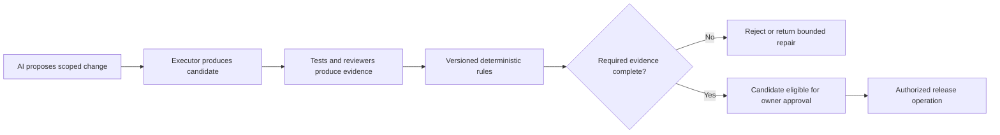

# Lakshly suites, access, and release plan

Status: proposal following the owner-authorized public-source audit, October 4, 2026. This document changes no application behavior, permissions, deployment, or subscription policy. Private source and external account consoles were not inspected.

## Product structure

Lakshly has six logical versions: Private/SuperUser and Public, each on Web, macOS, and iPhone. Beta is a release channel within Public. Build mode, such as Debug or Release, is a separate technical setting.

| Suite | Platform | Feature access | Release channels to support |
|---|---|---|---|
| Private | Web | SuperUser; all implemented, supported features unlocked for authorized users | Experimental first |
| Private | macOS | Same SuperUser policy | Experimental first |
| Private | iPhone | Same SuperUser policy | Experimental first |
| Public | Web | Free or Premium | Beta and Stable |
| Public | macOS | Same public access policy | Beta and Stable |
| Public | iPhone | Same public access policy | Beta and Stable |

Six product versions do not require six independent implementations. Share approved product rules, fixtures, design tokens, and portable logic. Keep proprietary experiments in the private source boundary. Public code must not acquire a runtime switch that grants SuperUser.

The owner wants the same visual identity and product behavior across devices. Use shared colors, typography, terminology, content, and interaction states, with adaptive navigation and layouts. Compare equivalent screens at appropriate sizes rather than requiring desktop and phone pixels to match. Native controls and platform-only capabilities need documented adaptations.

## Audited baseline and evidence

The source observations below are pinned to these commits, not to the current live sites:

- Public main: `cb58f9fd18254d050b62af68d9419e87f8ee0b8b`.
- Public Web Beta: `afee887d63bbb519523a1892f067b2ff2571a7ef`, including the merge of glass PR 29. Overview PR 30 was still open when checked.
- Pending Apple CI PR 32: `afd3156f1dddbdaa4c1c44603627822bfd049b4b`. Its workflow is not yet on main.

| Finding | Observed evidence | Implication |
|---|---|---|
| A shared access catalog already exists | [Catalog](https://github.com/ovhirup/lakshly/blob/cb58f9fd18254d050b62af68d9419e87f8ee0b8b/packages/shared/entitlements.json), consumed by the [Web generator](https://github.com/ovhirup/lakshly/blob/cb58f9fd18254d050b62af68d9419e87f8ee0b8b/apps/web/scripts/gen-entitlements.mjs#L9) | Extend and validate this foundation rather than replacing every app. |
| Web Beta forces Premium | [Beta AppState](https://github.com/ovhirup/lakshly/blob/afee887d63bbb519523a1892f067b2ff2571a7ef/apps/web/components/AppState.tsx#L33) returns Premium before reading the stored plan | Normal Beta UI cannot exercise Free behavior; its Profile Free toggle does not override this path. |
| Web paid access remains a preview | [Public resolver](https://github.com/ovhirup/lakshly/blob/cb58f9fd18254d050b62af68d9419e87f8ee0b8b/apps/web/lib/entitlements.ts#L6) and [Profile](https://github.com/ovhirup/lakshly/blob/cb58f9fd18254d050b62af68d9419e87f8ee0b8b/apps/web/app/profile/page.tsx#L93) use a local demo plan and say payments are not live | Browser storage is not verified payment authority. No billing implementation was found in the bounded public app/worker search; external services remain unknown. |
| Apple has a separate map | [Apple feature rules](https://github.com/ovhirup/lakshly/blob/cb58f9fd18254d050b62af68d9419e87f8ee0b8b/apps/apple/Lakshly/Store/Entitlements.swift#L5) are maintained manually, with generation/SuperUser support deferred | Current local-map tests do not prove shared JSON parity. |
| Entitlement and availability are different | [PremiumGate](https://github.com/ovhirup/lakshly/blob/cb58f9fd18254d050b62af68d9419e87f8ee0b8b/apps/apple/Lakshly/Components/PremiumGate.swift#L14) checks tier; [SetupSession](https://github.com/ovhirup/lakshly/blob/cb58f9fd18254d050b62af68d9419e87f8ee0b8b/apps/apple/Lakshly/Setup/SetupSession.swift#L237) says automatic sync is not switched on despite catalog permissions | Buying Premium cannot make unfinished functionality available. |
| Unknown access keys are not denied to Premium | [Web helper](https://github.com/ovhirup/lakshly/blob/cb58f9fd18254d050b62af68d9419e87f8ee0b8b/apps/web/lib/entitlements.ts#L26) and [Apple helper](https://github.com/ovhirup/lakshly/blob/cb58f9fd18254d050b62af68d9419e87f8ee0b8b/apps/apple/Lakshly/Store/Entitlements.swift#L88) default unknown/missing mappings to Premium-required; existing tests expect it | These are tier helpers, not a firewall for experimental or private availability. Migration needs explicit compatibility tests. |
| Native Beta distribution is unverified | [Apple project](https://github.com/ovhirup/lakshly/blob/cb58f9fd18254d050b62af68d9419e87f8ee0b8b/apps/apple/project.yml#L9) has public iOS/macOS schemes and Debug/Release settings; no channel model was found in the bounded inventory | This does not prove that TestFlight is absent outside the repo, or that separate bundle IDs are required. |
| Release guards depend on a configuration name | [Synthetic-resource guard](https://github.com/ovhirup/lakshly/blob/cb58f9fd18254d050b62af68d9419e87f8ee0b8b/apps/apple/project.yml#L58) and [Release checker](https://github.com/ovhirup/lakshly/blob/cb58f9fd18254d050b62af68d9419e87f8ee0b8b/apps/apple/scripts/check_release_launch_args.sh#L33) use literal `Release` | New configurations named Beta or Private could bypass existing protections. Keep channel orthogonal to build mode initially. |
| CI is useful but incomplete release evidence | [Apple run 37189181792](https://github.com/ovhirup/lakshly/actions/runs/37189181792): iOS 111 tests, 2 skips; macOS 105 tests, 8 skips; zero failures | Both skip two opt-in render tests; Mac also skips six StoreKit session methods. Normal macOS scene/menu behavior, visual parity, private suites, and Mac purchase flows remain unverified. |

The Web workflow builds the default environment; it does not explicitly build a Beta configuration or run browser visual comparisons. GitHub Pages deploys `site/`, the landing page, rather than the Web app. App deployment configuration, live served commits, native signing/distribution, and private authentication need separate evidence. Sources: [Web CI](https://github.com/ovhirup/lakshly/blob/afee887d63bbb519523a1892f067b2ff2571a7ef/.github/workflows/web.yml), [landing-page workflow](https://github.com/ovhirup/lakshly/blob/cb58f9fd18254d050b62af68d9419e87f8ee0b8b/.github/workflows/pages.yml).

## Proposed access and availability contract

Keep these dimensions independent:

| Dimension | Proposed values | Authority |
|---|---|---|
| Suite | Private, Public | Approved build/distribution plus authorized identity; never a public browser toggle |
| Channel | Experimental, Beta, Stable | Immutable build/release metadata and approved feature manifest |
| Platform | Web, macOS, iPhone | Build target and capability support |
| Access | SuperUser, Premium, Free | Private authorization or verified public entitlement; Beta simulations explicitly marked |
| Feature availability | Implemented, supported, enabled, approved for the channel | Versioned catalog/release policy, independently of payment |
| Build mode | Debug, Release | Compiler configuration; not a feature-access grant |

For a known feature, first determine availability for the suite, channel, and platform. Then evaluate access and limits. Unknown, unsupported, disabled, or unreleased features are unavailable even to Premium. SuperUser removes monetization restrictions for authorized private users; it does not make unsupported code implemented or bypass device/data permissions.

Public builds must reject a SuperUser claim. A paid entitlement cannot authorize private experiments. Beta must be able to exercise both Free and Premium, including a clearly labeled synthetic tier mode that is absent from Stable artifacts. Its default tier can remain a separate product decision; neither Beta branding nor a test purchase is evidence of a production payment.

Extend the existing catalog with stable feature IDs, supported platforms, public release availability, public minimum tier/limits, and an explicit policy version. Generate TypeScript and Swift data from the same approved public definition. Private feature definitions stay in a private extension with the same contract, not in public source or shipped assets. Never rename existing feature IDs or change the Free bill of rights as an incidental migration.

Verification of identity, signatures, and transaction state happens before policy evaluation. The policy receives verified facts, including provenance and an explicit evaluation time. Local storage may cache/display them, but cannot manufacture paid or private authority. Define expiry, refund, revocation, restore, offline grace, and cross-device ownership behavior before billing implementation. Whether one Premium purchase applies across all three platforms remains an owner decision, not an assumed capability.

## Build, data, and distribution boundaries

Use versioned shared public components/rules with platform adapters. Share private/public code only through an approved boundary; private source access and repository layout are still unverified. Private authorization requires a defined enrollment/revocation path, not only hidden URLs, `noindex`, an npm `private` flag, or Debug launch arguments.

Recommend synthetic-only Beta during setup, separate storage namespaces and service environments, and no automatic migration of production data into tests. For native apps, review bundle IDs, app groups, keychain groups, containers, and data migration together. Changing a bundle ID alone does not establish complete isolation.

TestFlight supports native beta distribution on iPhone and Mac. Installing a TestFlight version can replace the corresponding App Store app; therefore a channel name alone does not guarantee side-by-side installation or data separation. Test purchases do not carry into App Store versions. Choose either a deliberate same-identity upgrade/migration model or separate test identities before provisioning, and verify the resulting storage boundaries. Sources: [Apple TestFlight overview](https://developer.apple.com/help/app-store-connect/test-a-beta-version/testflight-overview/), [Apple tester guidance](https://testflight.apple.com/).

Keep Debug/Release configuration names while introducing channel metadata. Release-quality Beta candidates must retain resource-stripping and launch-argument safeguards. Test fixture shipping, sandbox purchase settings, and test-host compilation conditions must be governed explicitly, not inferred from the word Beta.

Every candidate needs a manifest: source commit, suite, channel, platform, version/build number, catalog/policy revision, artifact digest, data environment, entitlement provenance, and required evidence. Promote the same immutable candidate when supported by the distribution method. If channel policy or packaging requires a rebuild, record a new digest and repeat artifact/integration gates; source equality alone is not proof of artifact equality.

## Implementation sequence and ownership

These are proposed future batches. This audit implements none of them. No six-codebase rewrite is justified by the inspected evidence.

| Batch | Owner and boundary | Done condition |
|---|---|---|
| 1. Public Beta tier testability | Cursor; Web state/resolver tests and tier controls only, separate from glass/lotus/feedback CSS | Beta can exercise Free and synthetic Premium; Stable behavior is preserved; synthetic browser checks and explicit Beta build pass. |
| 2. Shared decision contract | Joint claim in `sync/handoff` before editing shared catalog/schema; one writer at a time | Validated versioned schema and truth-table fixtures; unknown/public-private/unsupported cases deny; Free rights remain unchanged. |
| 3. Generated platform adapters | Cursor owns Web consumer; Codex owns Swift generator/consumer; sequential or independent non-overlapping files | Both implementations produce the same decisions and limits from the shared fixtures; regeneration produces no drift. |
| 4. Purchase and identity authority | Separate design for Web billing, native product provisioning, private enrollment, and cross-device access | Verified purchase/restore/refund/revocation tests; no local flag grants paid access; private authority is independently demonstrated. Mac StoreKit skips cannot satisfy this gate. |
| 5. Beta distribution and isolation | Cursor owns Web environment/deployment; Codex owns native channel metadata and artifact checks | Versioned manifests, data-boundary tests, release guards, signed native candidates, and actual-device Beta evidence. External account changes need their own authority. |
| 6. Product and visual parity | Shared public token/content specification; each owner implements its platform | Equivalent setup/import/overview/paywall/settings states match the specification on desktop and phone, including dark mode, large text, reduced motion, keyboard/VoiceOver, and error states. Private parity requires authorized private evidence. |
| 7. Promotion and AI orchestration | Begin only after the preceding rules and gates are reliable | Deterministic evidence decisions, bounded agent jobs, human release authority, rollback records, and a dry run that cannot mutate production. |

Batch 1 is the smallest useful next implementation. Existing Web gates are `npm test`, `npm run typecheck`, `npm run lint`, and `NEXT_PUBLIC_LAKSHLY_EDITION=beta npm run build` from `apps/web`; synthetic browser checks must exercise both tiers. These commands are proposed for that change, not newly run by this audit.

For Apple changes, retain the existing synthetic fixture generator/oracle guard and `sh apps/apple/scripts/check_release_launch_args.sh`. Use hosted unit and purchase UI/device checks with actual counts and skip explanations. Do not launch a local app or simulator as part of this headless audit. New shared policy, visual, artifact, and data-isolation gates need implementation; no existing command is claimed for them.

## Promotion gates

Eligible features move from Private experimentation to Public Beta to Public Stable. A private-only feature never has to graduate. Public candidates use only approved public code; promotion is not copying a private checkout into this repo.

Each transition requires named owner, exact commit/artifact, catalog/policy revision, applicable platform/tier results, declared skips, synthetic import/password checks, entitlement evidence, visual/accessibility evidence, and a tested rollback/data-migration plan. Release-critical skipped checks block promotion until equivalent evidence is recorded. A green aggregate CI badge does not waive missing purchase or UI coverage.

Existing `main` and `web/beta` divergence requires a reviewed integration plan. This proposal authorizes no merge, rebase, signing change, deployment, purchase activation, or private-source rescue. Legacy roadmap wording such as “Private beta” must be clarified against the suite/channel distinction before it is treated as an implementation specification.

## Deterministic outcome engine and AI agents

Initial engine scope is access and release decisions. Financial calculations would require their own explicit schemas, arithmetic/rounding rules, and verification; they are not added implicitly to this scope.

Given the same validated inputs, evaluation time, and policy revision, the engine must return the same decision and reason. Suggested inputs are feature/build identity, trusted authorization/entitlement facts, required gate IDs, evidence tied to the artifact, skip/waiver status, and owner approval. Suggested outputs are allowed/blocked, reason codes, unmet requirements, effective limits, and an audit record.

Reject stale or wrong-artifact evidence, untrusted inputs, unknown rules, missing critical checks, and missing required authority. Do not let an AI summary or agent confidence override a failed gate. Keep the rule engine separate from side-effect executors, which enforce idempotency and authorized operations.

Agents receive exact ownership, scope, inputs, done conditions, and test commands. Parallelize read-only or non-overlapping work; use one writer for shared files. Preserve the existing two-repair-cycle cap and hard-stop escalation. Any scheduled orchestration needs a stop condition, maximum run count, and unchanged-run stop rule. The existing seven nightly handoff runs are doc-only and do not constitute release orchestration.

## Decisions needed before affected implementation

The audit can proceed without these answers; their dependent production/private work cannot:

1. Private suite enrollment/revocation and authorized source/repository boundary.
2. Whether Premium ownership spans platforms, and how users identify/restore it.
3. Same-identity TestFlight versus separate native test identities, including storage/migration expectations.
4. Which implemented features are eligible for Public Beta and Stable, and Beta's default test tier.
5. Web payment provider and verified authority, native product/distribution setup, and version numbering.
6. Offline entitlement grace, release-critical gate requirements, permitted waivers, and release approvers.

These are recorded decisions to resolve in the corresponding batches, not requests to stop the current documentation work.

## Audit validation

Two independent read-only passes inspected Web and Apple source at the pinned commits; the main pass inspected shared generation and release workflows. Evidence links distinguish source observations from unknown external/private state and proposed behavior. No app tests/builds were rerun for this documentation change; prior Apple CI evidence is explicitly attributed above. Final documentation checks and independent review are recorded in the accompanying PR.
